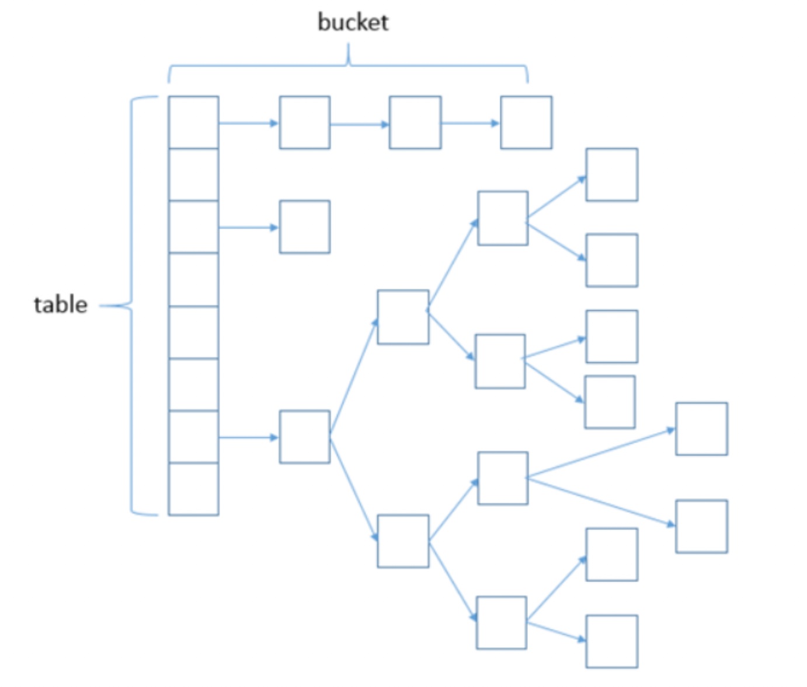

# 容器
`by: 程序员·小李`

> 常见的容器有哪些？是怎么分类的?

常见的容器分为两类，Collection和Map。

** Collection **: ArrayList, LinkedList, Vector, Stack, HashSet, LinkedHashSet, TreeSet

** Map **: HashMap, LinkedHashMap, TreeMap, ConcurrentHashMap, HashTable

> List、Set、Map有什么区别？

| 类型 | 是否有序 | 允许重复 | 
| :--: | :--: | :--: |
| List | 是 | 允许 |
| HashSet | 否 | 不允许 |
| TreeSet | 是 | 不允许 |
| HashMap | 否 | key不允许 |
| TreeMap | 是 | key不允许 |

> HashMap 和 Hashtable 有什么区别?

HashMap允许key和value为null, HashTable不允许。

HashMap不是线程安全的，HashTable是线程安全的。

> 使用 HashMap 还是 TreeMap?

HashMap对完成数据的查询和插入是非常高效的，但是不维护顺序。如果需要多次遍历时结果一致，TreeMap更合适。

> HashSet的实现？

HashSet的底层实际是由HashMap进行存储的，值作为HashMap的Key进行存储，因为HashMap允许key为null，所以HashSet的值也可为null，但是只能存在一个值。

```java
private static final Object PRESENT = new Object();
private transient HashMap<E,Object> map;

public HashSet() {
        map = new HashMap<>();
}

public boolean add(E e) {
        return map.put(e, PRESENT)==null;        
}
```

> HashMap的原理？

当存入key时，计算对应的hash值，存到对应的bucket中。当出现相同的hash值时，会采用链表的方式进行扩展，当冲突大于8时，采用红黑树的方式进行存储。

HashMap的扩容是依据当前容量和加载因子的乘积，当元素数量大于等于这个阈值时，HashMap开始扩容。HashMap初始化时，根据传入的容量值，计算一个最小的2的n次方，使得这个值刚好大于等于传入的容量值作为真正的容量。

> HashMap在JDK 1.7 与 1.8 中的区别

JDK的1.7版本中实现方式是采用链表的方式解决hash冲突，1.8版本是，当冲突小于8时，采用链表，当冲突大于等于8时，采用红黑树的方式进行存储。



> ArrayList和LinkedList的使用？

ArrayList对随机访问（按索引位置访问）是高效的，因为它采用的是动态数组的方式，连续的存储位置，计算索引位置是很快的。

LinkedList采用的是双向链表的方式进行的存储，存储空间并不一定是连续的，因此在随机存储方面效率较低。同时，LinkedList是维护元素的前后关联指针的，因此在指定位置上插入删除元素的操作是高效的，因为不像ArrayList一样，需要移动前/后全部元素的位置，只需要维护指针即可。

> Array 和 ArrayList 有何区别?

Array可以存储基本数据类型，而ArrayList只能存储包装类。

Array 是指定固定大小的，而 ArrayList 大小是自动扩展的。

> Queue的poll和remove方法的异同？

都是移除队首的元素并返回。

但是，poll在队列为空的时候返回null，而remove在队列为空的时候抛出NoSuchElementException。

> 迭代器的使用？

迭代器一般用于遍历集合中的元素，迭代器可以在遍历中完成刚刚遍历的元素的移除：iterator.remove();但是，在迭代器遍历元素的时候，集合本身不能都其进行修改，否则会抛出异常。

```java
List<String> list = new ArrayList<>(); 
Iterator<String> it = list. iterator(); 
while(it. hasNext()){
        String obj = it. next();
        System. out. println(obj); 
}
```

> 怎么确保一个集合不能被修改?

使用unmodifiableCollection修饰的集合不允许修改，否则会抛出UnsupportedOperationException异常

```java
List<String> list = new ArrayList<>();
list. add("x");
Collection<String> clist = Collections. unmodifiableCollection(list); 
clist. add("y"); // UnsupportedOperationException
System. out. println(list. size());
```